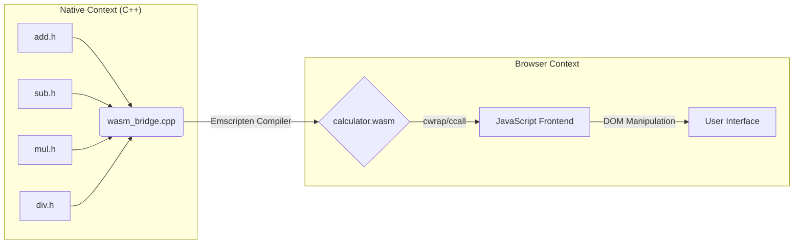

# Modular C++ Logic Kernel (WASM)


-black?style=for-the-badge)


A systems demonstration of **Hybrid-Runtime Architecture**. This project implements a modular C++ computational backend that is compiled to WebAssembly and accessed via a strict **Foreign Function Interface (FFI)**. It proves the ability to execute rigorous, type-safe C++ logic directly within the JavaScript event loop without server latency.

---

## 🏗 Architectural Pipeline

The project demonstrates a **Separation of Concerns** pattern. Raw logic resides in isolated C++ headers, while a dedicated "Bridge" file manages the API surface area exposed to the browser.



## 🚀 Engineering Features

* **Modular Backend:** Logic is decoupled into individual header files (`.h`), mimicking the structure of large-scale C++ libraries.
* **Explicit API Bridging:** Uses `wasm_bridge.cpp` to manually define the "Public API," ensuring that internal helper functions remain unexposed and secure.
* **Zero-Overhead Invocation:** Demonstrates the use of `ccall` and `cwrap` for direct memory access, bypassing the need for complex serialization protocols like JSON.

---

## 📂 System Structure

```text
.
├── cpp/                  # Native Logic Layer
│   ├── add.h             # Isolated Arithmetic Modules
│   ├── subtract.h
│   ├── main.cpp
│   └── wasm_bridge.cpp   # FFI Bridge (The "Gateway")
├── public/               # Runtime Artifacts
│   ├── calculator.js     # Emscripten Glue Code
│   └── calculator.wasm   # Compiled Binary
├── build.sh              # CI/CD Compilation Script
```

## 🛠️ Build & Compilation

To ensure reproducibility, this project uses a strict shell script to invoke the **Emscripten SDK**.

### The Compilation Protocol
The build script (`build.sh`) enforces specific compiler optimizations and function exporting:

```bash
emcc cpp/wasm_bridge.cpp -o public/calculator.js \
  -I./cpp \
  -s EXPORTED_FUNCTIONS='["_api_add", "_api_subtract", "_api_multiply", "_api_divide"]' \
  -s EXPORTED_RUNTIME_METHODS='["ccall", "cwrap"]' \
  -s WASM=1
```

* **`-s EXPORTED_FUNCTIONS`**: Prevents the compiler from optimizing away (Tree-Shaking) the functions we need.
* **`-s WASM=1`**: Forces the output to be a standalone `.wasm` binary rather than older asm.js polyfills.

---

## 🏃‍♂️ Runtime Deployment

Since WebAssembly requires strict MIME type handling and CORS permissions, the artifact cannot run via the file system.

**Initialization:**
```bash
# 1. Compile the Binary
chmod +x build.sh
./build.sh

# 2. Start Local Server
python3 -m http.server 8080 --directory public
```

---
<div align="center">
  <sub>Developed by Vanguard Secure Solutions</sub>
</div>
